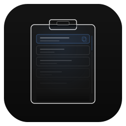
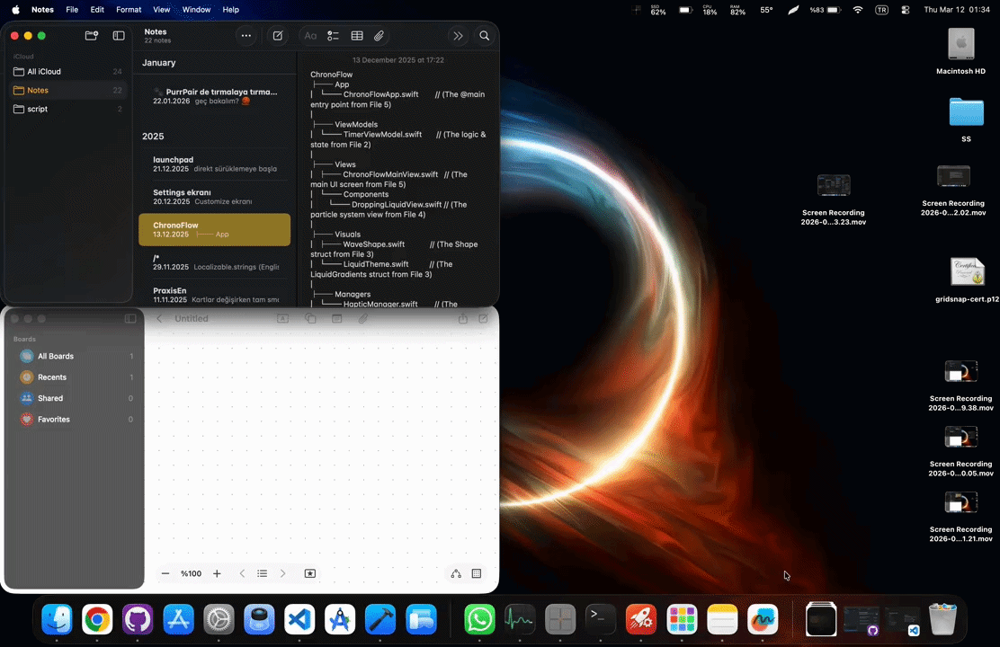

# Clibi

<p align="center">
  
</p>

<p align="center">
  A lightweight clipboard manager for macOS.<br>
  Keeps your last 100 copied items (text and images) accessible with a single shortcut.
</p>

<p align="center">
  
  
  
</p>

<p align="center">
  
</p>

## Screenshots

<p align="center">
  
  &nbsp;&nbsp;
  
  &nbsp;&nbsp;
  
</p>

## Features

- **Clipboard History** — Automatically stores the last 100 items you copy (configurable up to 500)
- **Image Support** — Captures and stores copied images; pastes them back as PNG into any app
- **Quick Access** — Press `⌃V` (Control+V) to open the history popup from anywhere
- **Custom Shortcut** — Change the hotkey to any key combination in Settings
- **Search** — Filter history by typing in the search field
- **Smart Paste** — Selecting an item pastes it directly into the focused app; if no input field is focused, it's copied to the clipboard instead
- **No Dock Icon, No Menu Bar** — Runs silently in the background; access Settings and Quit from the popup footer
- **Persistent** — History and window position survive app restarts
- **Resizable** — The popup can be resized and repositioned; it remembers its size and position

## Installation

### Build from Source

1. Clone the repository:
   ```bash
   git clone https://github.com/yourusername/Clibi.git
   ```
2. Open `Clibi.xcodeproj` in Xcode
3. Build and run (`⌘R`)

### Requirements

- macOS 14.0 or later
- Xcode 15.0 or later (to build from source)

## Setup

On first launch, macOS will ask you to grant **Accessibility** permission. This is required to:

- Register the global hotkey (`⌃V` by default)
- Simulate paste (`⌘V`) into the focused app

Go to **System Settings → Privacy & Security → Accessibility** and enable Clibi.

## Usage

| Action | How |
|--------|-----|
| Open clipboard history | Press `⌃V` (or your custom shortcut) |
| Paste an item | Click on it — pastes into the focused app |
| Copy without pasting | Right-click → Copy Only |
| Search | Type in the search field at the top |
| Delete an item | Right-click → Delete |
| Close popup | Press `Escape` or click outside |
| Clear all history | Trash icon in the popup footer |
| Open Settings | Gear icon in the popup footer |
| Quit | Power icon in the popup footer |
| Change shortcut | Settings → Shortcut — click the field and press your desired combo |

## Architecture

```
Clibi/
├── ClibiApp.swift          # App entry point, bridges openSettings environment action
├── AppDelegate.swift       # Hotkey and panel coordination (no menu bar or dock icon)
├── ClipboardItem.swift     # Data model (text and image kinds)
├── ClipboardStore.swift    # JSON persistence + image file management
├── ClipboardMonitor.swift  # Polls NSPasteboard every 0.5s for changes
├── HotkeyConfig.swift      # Arbitrary hotkey config, persisted in UserDefaults
├── HotkeyManager.swift     # Global shortcut registration (Carbon API)
├── HotkeyRecorderView.swift# Click-to-record shortcut field (custom NSControl)
├── PasteService.swift      # Clipboard write + ⌘V simulation
├── PopupPanel.swift        # Floating NSPanel with frame persistence
├── ClipboardListView.swift # SwiftUI list with search and footer actions
└── SettingsView.swift      # Preferences window
```

**Key decisions:**

- **No external dependencies** — Pure Swift + AppKit + SwiftUI
- **Carbon hotkey API** — Reliable global shortcut that consumes the key event (prevents characters from leaking into the active app)
- **NSPanel (non-activating)** — Popup appears without stealing focus from the active app
- **Timer-based polling** — Checks NSPasteboard every 0.5s via `changeCount`. Simple and reliable
- **PNG + TIFF on pasteboard** — Images are written with both `public.png` and `public.tiff` types so apps with strict type requirements (e.g. WhatsApp) receive them correctly
- **JSON + file storage** — Text history in `history.json`; images as PNG files in `Images/`

## Privacy

Clibi stores clipboard history **locally only**. No data is sent anywhere.

```
~/Library/Application Support/Clibi/history.json   # text history
~/Library/Application Support/Clibi/Images/        # image files
```

Delete this folder to remove all history.

## License

MIT — see [LICENSE](LICENSE) for details.
